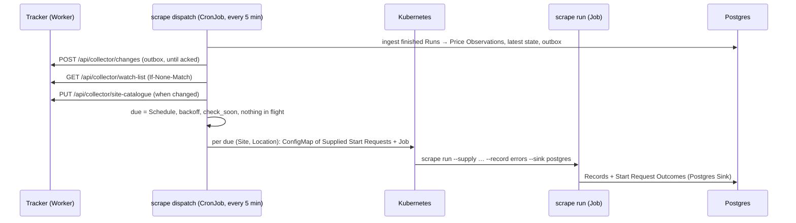

# Tracker integration: tech plan

Status: design accepted 2026-10-06. Implemented so far: `scrape run --supply` and the Accepts Rule (#56); Schedules, the Price Record contract and `aldi_picks` opting in (#57). Decisions: [ADR-0004](adr/0004-price-history-local-changes-to-tracker.md), [ADR-0005](adr/0005-dispatcher-schedules-supplied-start-requests.md). The Collector API contract is owned by the tracker: [groceries-tracker `docs/scraper-integration.md`](https://github.com/ivancli/groceries-tracker/blob/main/docs/scraper-integration.md). Terms: [CONTEXT.md](../CONTEXT.md). This resolves #44.

## Flow



A tick is idempotent and has `concurrencyPolicy: Forbid`. After the PC was off, the first tick finds everything overdue and catches up, with no extra mechanism.

## Site configuration

```yaml
site: aldi_picks
schedule: {every: 30m}            # optional `enabled: false` pauses the Site (the kill switch)
accepts:
  page_type: product
  url: '^https://www\.aldi\.com\.au/product/'
locations:                        # optional; `label` is shown in the tracker's Home Store picker
  sydney_g412: {label: "Sydney G412", service_point: G412}
```

Validation (`scrape validate`):
- A Site with `accepts` must have `schedule`, and vice versa.
- The accepted Page Type has no Follow Rules.
- The pattern compiles in the shared Python/JavaScript subset: anchored, no look-behind, no named groups.
- `every` is at least `defaults.yaml` `schedule.min_every` (15m).
- `scrape validate sites/` also rejects two Sites whose patterns claim the same URL. This is checked against example URLs listed with each Site (`accepts.examples`), because regex overlap can't be decided in general.

**Price Record contract.** An accepting Site's Record Type must declare these Fields:
- required: `url`, `name`, `price` (number, dollars)
- optional: `brand`, `size`, `regular_price`, `is_deal`, `unit_price`, `unit_basis`, `unit_price_text`, `price_kind`, `availability`, `store_verified`, `promo_text`

The Dispatcher converts dollars to cents with decimal arithmetic and rejects non-AUD values. A missing optional Field means "no evidence" (`null`), never `false`. `aldi_picks.yaml` gains `accepts`, `schedule` and `unit_price_text`.

## `scrape run --supply FILE`

- FILE is JSONL: `{"ref": "...", "url": "..."}`.
- The supplied requests replace `start:` and use the Accepts Rule's Page Type.
- Every Record carries `_meta.ref`. The Run writes `outcomes.jsonl`, one line per ref:

| Outcome | When |
|---|---|
| `ok` | at least one Record |
| `not_found` | 404/410 |
| `blocked` | 403/429, or a challenge detected by the Site's Health Checks |
| `skipped` | denied by robots, or never started before shutdown |
| `failed` | anything else, with the error |

- `run.json` records `supplied: true` and the ref count.
- The Postgres Sink gains a `scrape_outcomes` table. A supplied Run is exported whatever its Run Health, because outcomes are what the Dispatcher needs.
- Replay of a supplied Run reuses its supply, and its Records keep their original `scraped_at`. A Replay never feeds the Dispatcher: it ingests only Runs it created itself.

## Dispatcher store (Postgres schema `dispatch`)

| Table | Purpose |
|---|---|
| `watch_entries` | cached Watch List (`ref`, `url`, `location`, `check_soon`), plus its ETag |
| `dispatches` | one row per created Job: Site, Location, Job name, refs, created / finished / ingested |
| `checks` | every attempt: ref, Run, outcome, error, time (small; kept indefinitely) |
| `price_observations` | every successful check: Product State columns in cents, plus name/brand/size, Run id, Capture number |
| `latest_state` | per (`ref`): last Product State hash, `last_success_at`, health, `failing_since`, consecutive failures, last heartbeat date |
| `outbox` | items for the tracker: deterministic `id`, `kind`, payload, `created_at`, `sent_at`, attempts, last error |

**Ingesting a finished Run.** One transaction per Run:
1. Write the outcomes to `checks`.
2. For `ok`, insert into `price_observations`, compare with `latest_state` and enqueue a `change` if the state differs.
3. A move between `ok` and `failing` enqueues a `health` item.
4. The first success of the Sydney day, or any success while `check_soon` is set, enqueues a `heartbeat`.
5. `no_site`, `no_home_store`, `unknown_location`, `not_found` and `blocked` are each enqueued once per distinct value as `outcome` items.

Item ids are deterministic: `sha256(kind, site, location, ref, observed_at)`.

**Due rule.** An entry is due when nothing is in flight for its ref and either:
- `check_soon` is set and at least `min_every` has passed since its last attempt, or
- `every` has passed since its last success.

After a failure, the next try waits `every × 2^(n-1)`, capped at 24 hours. Due entries are grouped by (Site, Location) and chunked at 200 refs per Job.

**Kubernetes.**
- Each Job's supply lives in a ConfigMap, with an `ownerReference` to the Job so they're cleaned up together.
- Jobs are rendered by `scrape deploy job` (#48) with `--supply`, `--record errors` and the Postgres sink.
- The Dispatcher's ServiceAccount may create and get Jobs and ConfigMaps in its namespace, and nothing else.
- Tracker credentials (`CF-Access-Client-Id`/`Secret`, the tracker URL) come from Secret `scrape-dispatcher`.

## Retention

- Dispatched Runs use `record_level: errors`; manual Runs keep `all`.
- A janitor CronJob deletes Run directories after 14 days, and `failed`/`degraded` ones after 60 days.
- It also deletes the generic `scrape_records` rows of ingested dispatched Runs after 14 days. `price_observations` and `checks` are kept.
- A nightly `pg_dump` CronJob writes to a host path. This Postgres is the system of record for price history (ADR-0004).

## Local cluster additions (local overlay, #50)

- Postgres 16 StatefulSet on a `local-path` PVC.
- The `scrape-sinks` Secret pointing at it.
- The dispatcher CronJob, the janitor CronJob and the backup CronJob.

## First end-to-end slice

ALDI at `default`: a product linked in the tracker becomes a Watch List entry, then a dispatched `aldi_picks` Run, then a Price Observation in Postgres, then a `change` in the outbox, then a Price Change in D1, shown with its Last Checked time. A Replay or fixture price change produces exactly one new `change`. Locations, the janitor and backups follow.

## Tickets

Tracked under the `tracker-integration` label. Parent: #44.
